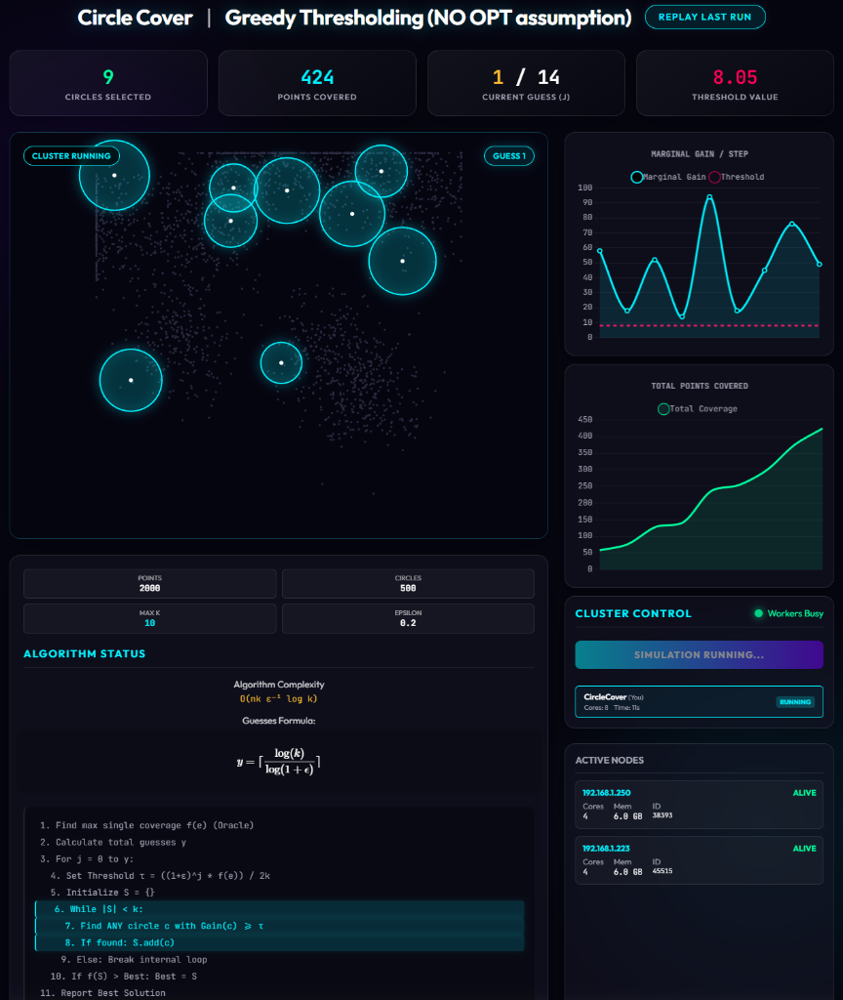

# Circle Cover Problem - PySpark Implementation

Greedy thresholding algorithm for the circle cover problem with **1/2(1-ε) approximation guarantee**, implemented using Apache Spark for distributed computing.

## Algorithm

The circle cover problem is a geometric variant of set cover: given a set of points P and candidate circles C, find k circles that cover the maximum number of points.

This implementation uses:
- **Greedy thresholding** with logarithmic guesses for unknown OPT
- **Submodular maximization** (coverage function is monotone submodular)
- **PySpark** for parallelizing marginal gain computation



## Quick Start

### Local Mode (Windows/Linux)

```bash
# Create virtual environment
python -m venv .venv
.venv/Scripts/activate  # Windows
source .venv/bin/activate  # Linux

# Install dependencies
pip install -r requirements.txt

# Run locally
python main.py
```

### Cluster Mode (Raspberry Pi)

```bash
# SSH to master node
ssh pi@raspberrypi

# Run on cluster
~/spark-env/bin/python ~/main.py --cluster
```

---

## Raspberry Pi Cluster

### Cluster Information

| Node | Role | IP | Cores | Memory |
|------|------|-----|-------|--------|
| raspberrypi | Master + Worker | 192.168.1.223 | 4 | 6GB |
| applepi | Worker | 192.168.1.250 | 4 | 6GB |

**Total Resources:** 8 cores, 12GB memory

### Web Interfaces

| Service | URL |
|---------|-----|
| Spark Master UI | http://raspberrypi:8080 |
| Spark Application UI | http://raspberrypi:4040 (when app running) |

### Cluster Management

#### Start Cluster
```bash
# Start master
ssh pi@raspberrypi "export JAVA_HOME=/usr/lib/jvm/java-21-openjdk-arm64 && ~/spark/sbin/start-master.sh"

# Start worker on raspberrypi
ssh pi@raspberrypi "export JAVA_HOME=/usr/lib/jvm/java-21-openjdk-arm64 && ~/spark/sbin/start-worker.sh spark://192.168.1.223:7077"

# Start worker on applepi
ssh pi@applepi "export JAVA_HOME=/usr/lib/jvm/java-21-openjdk-arm64 && ~/spark/sbin/start-worker.sh spark://192.168.1.223:7077"
```

#### Stop Cluster
```bash
# Stop all (from master)
ssh pi@raspberrypi "~/spark/sbin/stop-all.sh"

# Or stop individually
ssh pi@raspberrypi "~/spark/sbin/stop-worker.sh"
ssh pi@raspberrypi "~/spark/sbin/stop-master.sh"
ssh pi@applepi "~/spark/sbin/stop-worker.sh"
```

#### Check Status
```bash
# Check running Java processes
ssh pi@raspberrypi "jps"
ssh pi@applepi "jps"

# View logs
ssh pi@raspberrypi "tail -50 ~/spark/logs/spark-pi-org.apache.spark.deploy.master.Master-1-raspberrypi.out"
```

### Deploy Application

```bash
# Copy script to Pi
scp main.py pi@raspberrypi:~/main.py

# Run on cluster
ssh pi@raspberrypi "~/spark-env/bin/python ~/main.py --cluster"
```

### Visualization Dashboard

The project includes a real-time web visualization dashboard.

**Start the Server:**
```bash
ssh pi@raspberrypi
# Start the visualization server (runs on port 8000)
~/spark-env/bin/python ~/viz_server.py
```

**Access the UI:**
Open `http://raspberrypi:8000` in your browser.

**Features:**
- **Real-time Visualization**: See points and circles as they are covered.
- **Cluster Control**: Start new internal optimizations directly from the UI.
- **Live Worker Stats**: Monitor core/memory usage of connected nodes.
- **Algorithm Metrics**: Track marginal gain and total coverage graphs.


---

## Configuration

Edit parameters in `main.py`:

```python
N_POINTS = 500      # Number of points to cover
N_CIRCLES = 100     # Number of candidate circles
N_CLUSTERS = 3      # Point clusters for data generation
K = 5               # Maximum circles to select
EPSILON = 0.2       # Approximation parameter
```

Cluster settings in `create_spark_session()`:

```python
SPARK_MASTER_URL = "spark://192.168.1.223:7077"
```

---

## Project Structure

```
PI-Cluster/
├── main.py              # Main algorithm implementation
├── viz_server.py        # Visualization backend (FastAPI)
├── ui/                  # Frontend assets
│   ├── index.html       # Dashboard UI
│   ├── style.css        # Glassmorphism styles
│   └── script.js        # Visualization logic
├── requirements.txt     # Python dependencies
├── README.md            # This file
└── CLUSTER_SETUP.md     # Detailed cluster setup guide
```

---

## Requirements

### Local Development
- Python 3.11+
- Java 17+ (for Spark)
- See `requirements.txt`

### Raspberry Pi Cluster
- Raspberry Pi 5 (8GB RAM recommended)
- Raspberry Pi OS (Debian Trixie)
- Java 21
- Python 3.13

---

## References

- [Apache Spark Documentation](https://spark.apache.org/docs/latest/)
- Submodular maximization for set cover problems
- Greedy thresholding algorithm with logarithmic guesses
